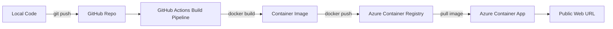
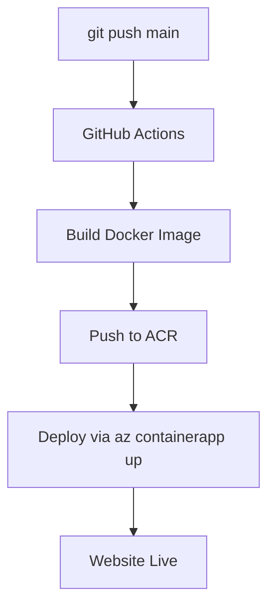

#  Personal Website Deployment (Docker  Azure Container Apps  GitHub Actions CI/CD)

This project demonstrates how to build, containerize, push, and deploy a FastAPI web application using Docker, Azure Container Registry (ACR), Azure Container Apps (ACA), and GitHub Actions CI/CD. It's a compact learning blueprint for beginners and intermediate cloud engineers.

Prerequisites:
- `git`, `docker` and `docker-compose` (optional)
- `az` (Azure CLI) installed and logged in
- A GitHub account with repository push access

---

##  Architecture Overview



---

##  1. Build the Docker Image (Locally)

Example `Dockerfile` used by this project:

```dockerfile
FROM python:3.12-slim

WORKDIR /app

COPY requirements.txt .

RUN pip install --no-cache-dir -r requirements.txt

COPY . .

CMD ["uvicorn", "app:app", "--host", "0.0.0.0", "--port", "8000"]
```

Build the image locally:

```bash
docker build -t personal-site .
```

Run locally:

```bash
docker run -p 8000:8000 personal-site
```

Open `http://localhost:8000` in your browser.

---

##  2. Create Azure Resources

Login to Azure if you haven't already:

```bash
az login
```

Create a resource group:

```bash
az group create --name personal-site-rg --location eastus
```

Create an Azure Container Registry (ACR):

```bash
az acr create --resource-group personal-site-rg --name suryamishraacrregistry --sku Basic
```

Enable ACR admin (optional but useful for simple demos):

```bash
az acr update -n suryamishraacrregistry --admin-enabled true
```

Get ACR credentials:

```bash
az acr credential show -n suryamishraacrregistry
```

---

##  3. Push Image to ACR (Manually or via CI)

Login to ACR and push the image:

```bash
az acr login -n suryamishraacrregistry
docker tag personal-site suryamishraacrregistry.azurecr.io/personal-site:v1
docker push suryamishraacrregistry.azurecr.io/personal-site:v1
```

---

##  4. Deploy to Azure Container Apps

Register any missing providers (only required once per subscription):

```bash
az provider register --namespace Microsoft.Web
az provider register --namespace Microsoft.App
az provider register --namespace Microsoft.OperationalInsights
```

Create a Container Apps environment:

```bash
az containerapp env create --name surya-container-env --resource-group personal-site-rg --location eastus
```

Deploy the Container App (replace `<username>`/`<password>` with real values or use CI-secret retrieval):

```bash
az containerapp create \
  --name surya-personal-site \
  --resource-group personal-site-rg \
  --environment surya-container-env \
  --image suryamishraacrregistry.azurecr.io/personal-site:v1 \
  --target-port 8000 \
  --ingress external \
  --registry-server suryamishraacrregistry.azurecr.io \
  --registry-username <username> \
  --registry-password <password>
```

Retrieve the app URL:

```bash
az containerapp show --name surya-personal-site --resource-group personal-site-rg --query properties.configuration.ingress.fqdn -o tsv
```

---

##  5. GitHub Actions CI/CD



---

##  6. Full GitHub Actions Workflow

Below is a sample `deploy.yml` workflow. Keep secrets like `AZURE_CREDENTIALS` in GitHub Secrets.

```yaml
name: Build and deploy to Azure Container Apps

on:
  push:
    branches:
      - main

env:
  ACR_NAME: suryamishraacrregistry
  ACR_LOGIN_SERVER: suryamishraacrregistry.azurecr.io
  IMAGE_NAME: personal-site
  RESOURCE_GROUP: personal-site-rg
  CONTAINERAPPS_ENVIRONMENT: surya-container-env
  CONTAINERAPPS_NAME: surya-personal-site
  LOCATION: eastus

jobs:
  build-and-deploy:
    runs-on: ubuntu-latest

    steps:
      - name: Checkout code
        uses: actions/checkout@v4

      - name: Log in to Azure
        uses: azure/login@v2
        with:
          creds: ${{ secrets.AZURE_CREDENTIALS }}

      - name: Log in to ACR
        run: az acr login --name $ACR_NAME

      - name: Build and push image to ACR
        run: |
          docker build -t $ACR_LOGIN_SERVER/$IMAGE_NAME:${{ github.sha }} .
          docker push $ACR_LOGIN_SERVER/$IMAGE_NAME:${{ github.sha }}

      - name: Deploy to Azure Container Apps
        uses: azure/CLI@v2
        with:
          inlineScript: |
            echo " Checking if Container Apps environment exists..."
            EXISTING_ENV=$(az containerapp env show --name "$CONTAINERAPPS_ENVIRONMENT" --resource-group "$RESOURCE_GROUP" --query "name" -o tsv 2>/dev/null || true)

            if [ -z "$EXISTING_ENV" ]; then
              echo " Environment not found. Creating..."
              az containerapp env create --name "$CONTAINERAPPS_ENVIRONMENT" --resource-group "$RESOURCE_GROUP" --location "$LOCATION"
            else
              echo " Environment already exists. Skipping creation."
            fi

            echo " Enabling ACR admin..."
            az acr update -n "$ACR_NAME" --admin-enabled true

            echo " Retrieving ACR credentials..."
            ACR_USERNAME=$(az acr credential show -n "$ACR_NAME" --query "username" -o tsv)
            ACR_PASSWORD=$(az acr credential show -n "$ACR_NAME" --query "passwords[0].value" -o tsv)

            echo " Deploying container app..."
            az containerapp up --name "$CONTAINERAPPS_NAME" --resource-group "$RESOURCE_GROUP" --environment "$CONTAINERAPPS_ENVIRONMENT" --image "$ACR_LOGIN_SERVER/$IMAGE_NAME:${{ github.sha }}" --target-port 8000 --ingress external --registry-server "$ACR_LOGIN_SERVER" --registry-username "$ACR_USERNAME" --registry-password "$ACR_PASSWORD"
```

---

##  7. Custom Domain Setup (example: `theysurya.net`)

Steps (high level):
1. Open your Container App in the Azure Portal
2. Go to **Custom Domains** and add the desired hostname
3. Create the required DNS records (A or CNAME) with your DNS provider
4. Validate DNS ownership in the portal
5. Enable the free TLS certificate

---

##  Summary

This guide covers containerizing a FastAPI app, pushing images to ACR, deploying to Container Apps, and wiring up CI/CD with GitHub Actions. It is intended to be a concise, practical reference for getting a website live on Azure.

If you'd like, I can:
- run a Markdown linter locally to check for issues
- commit and push these README changes
- validate the `deploy.yml` workflow with a YAML linter
